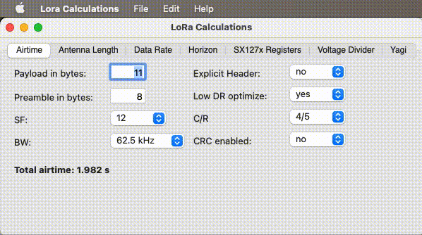
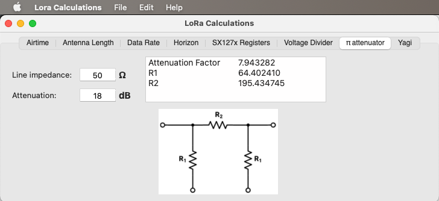
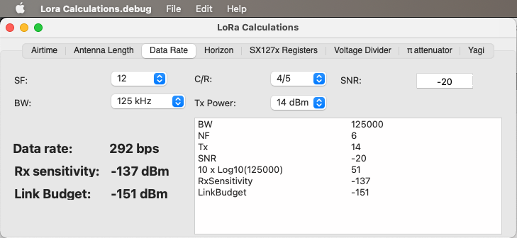

# Lora-Calculations

This is a small Xojo app I wrote to replace an Excel file I have created, and updated, over the years, to help me with calculations, some related to LoRa, some not so much. Instead of googling again and again, I would create a new tab and add a formula.

## Now in a nice GUI application!

Using Xojo it was easy enough to convert these sheets into tabs of similarly looking formulas, with text fields to change values, and results being output where convenient.

Only the Mac OS X x86 version has been tested. But considering the simplicity of the code I don't expect (m)any issues with the other versions. Do report any you may encounter! Thanks!

## UPDATES

Thanks to a friend in the CALM Discord community, I added a tab for a π attenuator.

Thanks to a user Puzzled Pancake in the Meshtastic Discord, I added calculations for the Link Budget Data Rate tab.

Added, thanks to the same friend, a solver: given a target Resistance Rc, it takes pairs in the e12, e24, e48 series, and gets you matching pairs within 5%.

